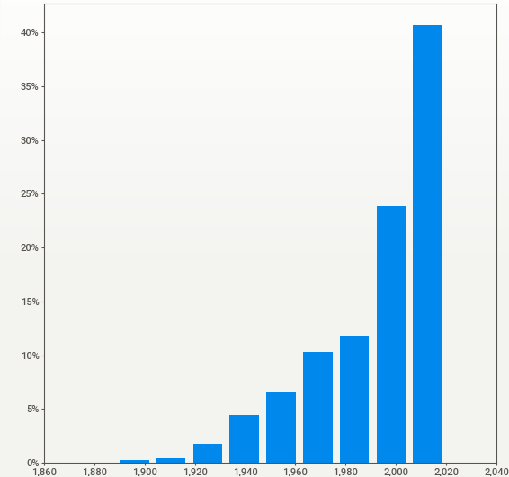
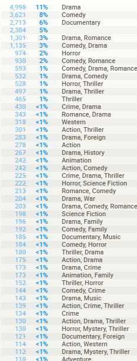
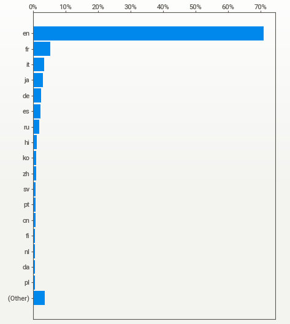
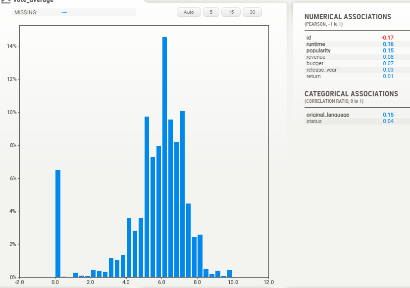
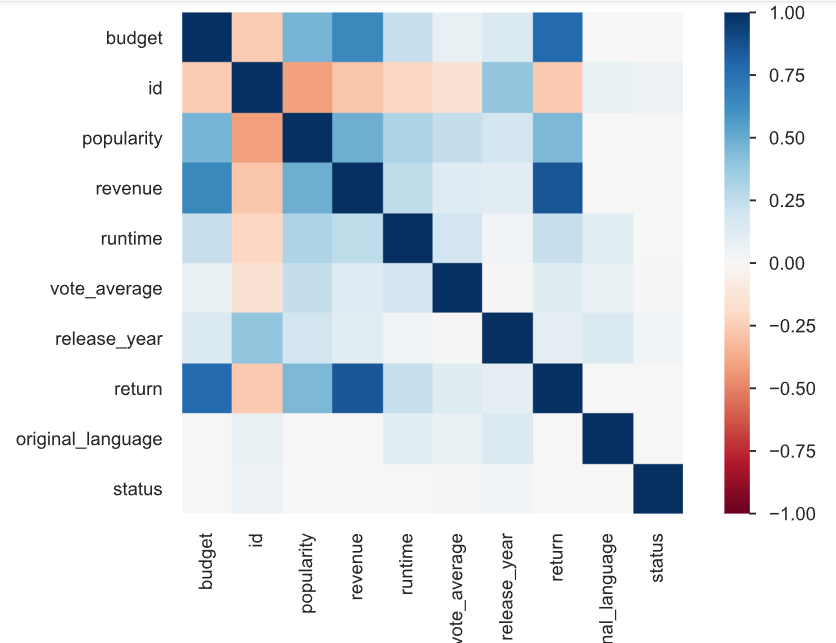

# Modelo de Recomendación para Servicios de Agregación de Plataformas de Streaming

## Descripción del problema

En este repositorio se presenta una solución para llevar un modelo de recomendación de películas y series del ámbito de la investigación y desarrollo al mundo real. El objetivo es implementar un sistema de recomendación en una start-up que provee servicios de agregación de plataformas de streaming.

## Contexto

El contexto de este proyecto se encuentra en una start-up que busca ofrecer a sus usuarios recomendaciones personalizadas de películas y series de diversas plataformas de streaming. 

### Como trabajo de desarrollan los siguientes puntos: 
- Analizar los datos existentes y comprender su estructura y calidad.
- Realizar tareas de Data Engineering para limpiar, transformar y preparar los datos de manera adecuada para el modelo de recomendación.
- Diseñar e implementar un modelo de Machine Learning que pueda generar recomendaciones personalizadas.

# EDA
Por medio de una analisis de datos exploratorio se encontraron las siguientes caracteristicas.

A partir del año 2000, se ha observado un notable incremento en la producción de películas en comparación con décadas anteriores. Este fenómeno puede atribuirse a diversos factores, entre los cuales se destacan el aumento de la demanda por parte del sector del entretenimiento y la disminución de los costos de producción.

En primer lugar, la creciente demanda de contenido audiovisual ha desempeñado un papel fundamental en el incremento de la producción cinematográfica. Con el avance de la tecnología y la proliferación de dispositivos como smartphones, tablets y plataformas de streaming, la audiencia ha experimentado un crecimiento significativo. Los consumidores ahora tienen acceso a una amplia variedad de películas y programas de televisión, lo que ha generado una mayor necesidad de contenido fresco y diverso para satisfacer sus preferencias.

Además, los avances tecnológicos han permitido reducir los costos de producción de películas. La digitalización de los procesos de filmación, edición y efectos especiales ha simplificado y agilizado la creación de películas, lo que ha llevado a una disminución en los costos asociados. Las cámaras digitales de alta calidad y las herramientas de postproducción accesibles han democratizado la producción cinematográfica, permitiendo a un mayor número de cineastas materializar sus ideas sin incurrir en grandes gastos.

Asimismo, la globalización y la apertura de nuevos mercados han impulsado la producción cinematográfica. Las películas ahora tienen la capacidad de llegar a audiencias internacionales más amplias gracias a la distribución en línea y a los acuerdos comerciales entre diferentes países. Esto ha generado incentivos para aumentar la producción de películas con el objetivo de alcanzar un mercado más diverso y rentable.

Los géneros que predominan en la producción cinematográfica actualmente incluyen la comedia, el drama, los documentales, el romance, el horror y varios generos . Esta tendencia se debe a una combinación de factores que reflejan tanto las preferencias del público como las dinámicas de la industria.

En primer lugar, la comedia se ha mantenido como uno de los géneros más populares a lo largo de la historia del cine. Las películas cómicas suelen ofrecer al público un escape divertido y ligero, brindando momentos de entretenimiento y risas. La comedia abarca una amplia gama de subgéneros, desde la comedia romántica hasta la comedia de situación o la comedia satírica, lo que permite una variedad de opciones para satisfacer los diferentes gustos de la audiencia.

El drama es otro género que ha mantenido una fuerte presencia en el cine. Las películas dramáticas exploran temáticas profundas y emocionales, abordando cuestiones universales de la condición humana. El drama puede ofrecer narrativas intensas y conmovedoras, y a menudo es reconocido por sus actuaciones destacadas y guiones impactantes. Este género atrae a aquellos que buscan historias con contenido emocionalmente impactante y reflexivo.

Los documentales también han ganado popularidad en los últimos años. Estas películas se centran en hechos reales y suelen abordar temas históricos, sociales, científicos o culturales. Los documentales ofrecen una perspectiva informativa y educativa, y tienen la capacidad de generar conciencia y promover el debate sobre diversos temas. La demanda de documentales ha crecido debido al interés en el aprendizaje, la curiosidad por el mundo y la búsqueda de historias basadas en la realidad.

El romance es un género arraigado en el cine desde sus inicios. Las historias de amor y las relaciones humanas han sido una fuente constante de interés y fascinación para el público. Las películas románticas abarcan una amplia gama de subgéneros, como las comedias románticas, los dramas románticos y las historias de amor épicas. Estas películas suelen ser populares entre aquellos que buscan una experiencia emocionalmente satisfactoria y un escape romántico en la pantalla.

El género de horror ha sido una opción popular para aquellos que buscan emociones fuertes y experiencias aterradoras. Las películas de terror exploran el miedo y la tensión, y a menudo presentan elementos sobrenaturales, criaturas aterradoras o situaciones angustiantes. Este género atrae a los amantes de las emociones fuertes y ofrece una dosis de adrenalina y suspense.

En la producción cinematográfica, el idioma que predomina con una amplia diferencia es el inglés. El inglés se ha establecido como el idioma dominante en la industria del cine a nivel mundial. La mayoría de las películas de gran presupuesto y éxito comercial son producidas en inglés, lo que les permite llegar a audiencias internacionales de manera más efectiva.

Después del inglés, hay otros idiomas que también tienen una presencia significativa en la producción cinematográfica. Algunos de los idiomas más prominentes en el cine incluyen:

- Francés: Francia tiene una larga tradición cinematográfica y ha producido películas aclamadas a nivel internacional. El cine francés se caracteriza por su enfoque artístico y su narrativa reflexiva.

- Italiano: El cine italiano también ha dejado una huella importante en la historia del cine, especialmente durante el período del neorrealismo italiano. El cine italiano ha influido en muchos directores y estilos cinematográficos en todo el mundo.

- Japonés: Japón es conocido por su distinguida industria cinematográfica, que ha producido películas reconocidas a nivel global. El cine japonés abarca una amplia gama de géneros, desde el anime hasta el cine de autor y los dramas históricos.

- Alemán: Alemania ha tenido un impacto significativo en la historia del cine, particularmente durante el movimiento del cine expresionista alemán en la década de 1920. Además, el cine alemán contemporáneo ha ganado reconocimiento internacional en los últimos años.

- Español: El cine en español es diverso y abarca películas producidas en España y en América Latina. España tiene una industria cinematográfica vibrante, y países como México, Argentina y Colombia también han contribuido con películas aclamadas internacionalmente.

- Ruso: Rusia tiene una rica tradición cinematográfica que se remonta a la época del cine mudo. El cine ruso se caracteriza por su enfoque artístico y sus temas profundos.

Además de estos idiomas mencionados, hay muchos otros idiomas que también contribuyen a la producción cinematográfica en diferentes regiones del mundo. Cada idioma tiene su propia identidad cultural y contribuye a la diversidad y riqueza del cine global.

En relación a los votos de la audiencia, se ha observado una acumulación predominante en el rango de puntuaciones que van desde cuatro hasta ocho, con un promedio generalmente cercano a seis puntos. Esto sugiere que la mayoría de los espectadores tienden a calificar las películas en un rango medio, evitando puntajes extremadamente bajos o altos.

Además, se ha identificado una correlación débil entre la duración de la película y su popularidad. Esto implica que el tiempo de duración de una película no es necesariamente un factor determinante en su popularidad o en cómo es percibida por los espectadores. Es posible que otras variables, como la calidad del guion, las actuaciones, la dirección o la trama, tengan un impacto más significativo en la recepción y calificación de las películas por parte de la audiencia, por lo que, la duración y la popularidad, pueden influir en los puntajes otorgados por la audiencia, pero no de manera determinante. Cada espectador tiene sus propios criterios y preferencias al evaluar una película, y estos pueden variar ampliamente. Es importante tener en cuenta que la percepción subjetiva y los gustos individuales desempeñan un papel fundamental en la forma en que los espectadores califican y evalúan una película.

Basándonos en la matriz de correlación del dataframe completo, se observa una relación significativa entre el retorno, la popularidad y los ingresos. Específicamente, el retorno está ampliamente correlacionado con la popularidad y los ingresos de la película. Esto implica que las películas que son populares entre el público tienden a generar mayores ingresos y, a su vez, pueden tener un mayor retorno en comparación con aquellas que no son tan populares.

Además, se encuentra una correlación fuerte entre los ingresos y la popularidad de las películas. Esto indica que las películas que generan mayores ingresos tienden a ser más populares entre los espectadores. Esta relación puede deberse a una mayor promoción, un elenco reconocido, una trama atractiva o una combinación de factores que aumentan el interés del público y, a su vez, impulsan los ingresos generados por la película.

En menor medida, se observa una correlación entre el promedio de votos y el retorno. Esto indica que si bien el promedio de votos puede tener cierta influencia en el retorno, existen otros factores, como la popularidad y los ingresos, que pueden tener un impacto más significativo en el éxito financiero de una película.

Además, el ingreso se correlaciona fuertemente con el presupuesto y, en menor medida, con la duración de la película. Esto sugiere que el presupuesto invertido en una película puede tener un impacto en los ingresos generados, y que las películas más largas pueden tener cierta influencia en su capacidad para generar ingresos, aunque esta correlación es menos pronunciada.

En resumen, según la matriz de correlación del dataframe completo, se puede observar que el retorno está estrechamente relacionado con la popularidad y los ingresos de una película. Los ingresos, a su vez, se correlacionan fuertemente con la popularidad, el presupuesto y, en menor medida, con la duración de la película. El presupuesto también muestra correlaciones significativas con los ingresos, la popularidad, la duración y el retorno de la película. Estas relaciones pueden proporcionar información valiosa sobre los factores que influyen en el éxito financiero y la recepción de una película por parte del público.

Se observa que existen mas relaciones muchas más relaciones y variables que pueden ser interesantes de explorar para determinar si una película puede tener éxito comercial.

# Desarrollo API
Tiene como objetivo disponibilizar los datos de la empresa mediante una API utilizando el framework FastAPI. Las consultas que se proponen son las siguientes:

### Endpoints disponibles
Se han creado 6 funciones para los endpoints que se consumirán en la API. Cada función tiene un decorador que define el método HTTP correspondiente (@app.get('/')).

#### peliculas_mes(mes)
Esta función recibe un mes y devuelve la cantidad de películas que se estrenaron históricamente en ese mes. 

#### peliculas_dia(dia)
Esta función recibe un día y devuelve la cantidad de películas que se estrenaron históricamente en ese día. 

#### franquicia(franquicia)
Esta función recibe una franquicia y devuelve la cantidad de películas, la ganancia total y el promedio de ganancias de la franquicia. 

#### peliculas_pais(pais)
Esta función recibe un país y devuelve la cantidad de películas producidas en ese país. 

#### productoras(productora)
Esta función recibe una productora y devuelve la ganancia total y la cantidad de películas que produjo. 

#### retorno(pelicula)
Esta función recibe una película y devuelve la inversión, la ganancia, el retorno y el año en que se lanzó.

#### recomendacion(titulo)
Esta función recibe el título de una película y devuelve una lista de 5 películas similares recomendadas. 
